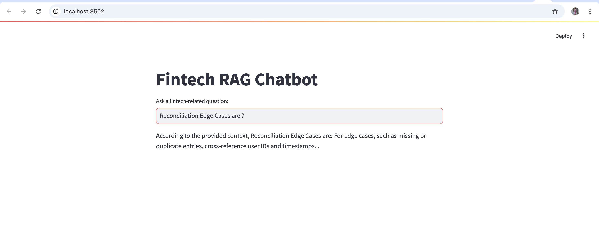
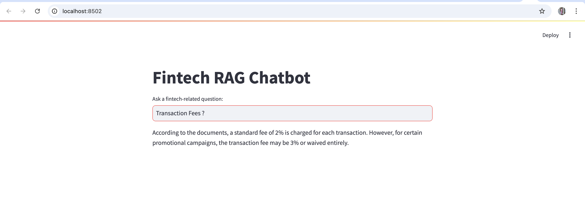

# FinRAGBot - Fintech RAG Chatbot




## Overview
FinRAGBot is a streamlined AI chatbot designed to assist users in a mock fintech scenario using Retrieval-Augmented Generation (RAG). The chatbot retrieves relevant financial policy documents before generating responses using Groq's LLaMA model.

## Features
- **Retrieval-Augmented Generation (RAG):** Enhances responses by fetching relevant fintech-related documents.
- **LangChain Integration:** Uses LangChain's ConversationalRetrievalChain to handle retrieval and response generation.
- **Vector Database:** FAISS is used for efficient document search.
- **Large Language Model (LLM):** Utilizes Groq's LLaMA model for natural language understanding and response generation.
- **Streamlit UI:** A user-friendly interface for querying the chatbot.

## Dataset - Fintech Documents
The chatbot uses a mock fintech dataset stored in `fintech_documents.csv`, containing 10 documents with conflicting financial policies, including:
- **Refund Policies:** Conflicting refund processing periods (7 days vs. 14 days).
- **Transaction Fees:** Standard fees vs. promotional exceptions.
- **Reconciliation Guidelines:** Standard vs. edge-case reconciliation methods.
- **Data Privacy Policies:** Encryption methods and user consent rules.
- **Overdraft and Dispute Policies:** Handling negative balances and transaction disputes.

## Setup Instructions
### 1. Clone the Repository
```bash
git clone <repository-url>
cd FinRAGBot
```

### 2. Install Dependencies
```bash
pip install -r requirements.txt
```

### 3. Set Up Environment Variables
Create a `.env` file and add your Groq API key:
```
GROQ_API_KEY=your_api_key_here
```

### 4. Run the Chatbot
```bash
streamlit run app.py
```

## How It Works
1. **Load Documents:** The CSVLoader reads fintech documents from `fintech_documents.csv`.
2. **Create Embeddings:** The text is converted into vector embeddings using HuggingFaceEmbeddings.
3. **Store in FAISS:** The embeddings are indexed in a FAISS vector store for efficient retrieval.
4. **Query Processing:** When a user asks a question, relevant documents are retrieved.
5. **Response Generation:** The LLaMA model generates an answer based on the retrieved content.
6. **User Display:** The response is shown on the Streamlit UI.

## Future Improvements
- **Multi-Turn Conversation:** Add memory for context-aware responses.
- **Advanced Contradiction Handling:** Implement ranking for conflicting policies.
- **Analytics Dashboard:** Track user queries and improve retrieval accuracy.

